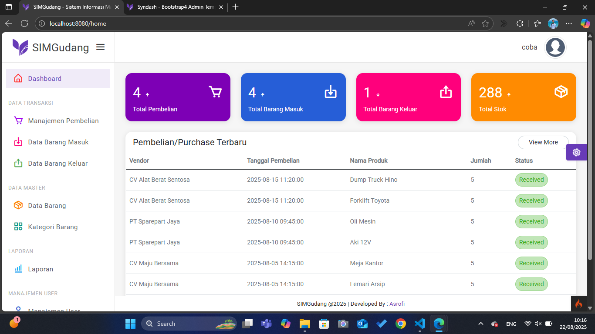

# SIMGudang

**Sistem Informasi Manajemen Gudang Berbasis Web**
Dibangun dengan **CodeIgniter 4**, **PHP 8.2**, dan template **Syndash (Bootstrap)**.


---

## 📂 Struktur Proyek

```
project-root/
│── app/                       # Folder utama aplikasi CI4
│   ├── Config/                # Konfigurasi project (BaseURL, Database, dsb.)
│   ├── Controllers/           # Logic aplikasi (Home, Products, Purchase, dsb.)
│   ├── Models/                # Model untuk query database
│   ├── Views/                 # Halaman tampilan (Blade-like CI4)
│   │   ├── layouts/           # Template global (navbar, footer, template)
│   │   ├── Auth/              # Tampilan autentikasi
│   │   ├── user/              # Tampilan manajemen user
│   │   ├── category.php       # Tampilan Data Category
│   │   ├── home.php           # Tampilan dashboard
│   │   ├── incoming_item.php  # Tampilan Data Barang Masuk
│   │   ├── outgoing_item.php  # Tampilan Data Barang Keluar
│   │   ├── purchase.php       # Tampilan Data Pembelian/Purchase
│   │   ├── report_index.php   # Tampilan index Laporan
│   │   ├── report.php         # Tampilan Laporan Data Barang Masuk, Barang Keluar, dan Stok
│   │   └── product.php        # Tampilan Data Produk
│── public/                    # Folder akses publik (CSS, JS, Images, Assets)
│── writable/                  # Cache, logs, uploads
│── .env                       # Konfigurasi environment (database, app url, dll.)
│── composer.json              # Dependency project
```

---

## ✨ Fitur Utama

1. **Dashboard**

   - Ringkasan total pembelian, barang masuk, barang keluar, dan total stok.
   - Tabel "Pembelian Terbaru" untuk memantau transaksi terakhir.

2. **Manajemen Pembelian**

   - Input transaksi pembelian dari vendor.
   - Tracking status pembelian (Received).

3. **Data Barang Masuk & Keluar**

   - Catat semua barang yang masuk/keluar gudang.
   - Update otomatis stok barang.

4. **Data Master**

   - **Data Barang**: CRUD data barang.
   - **Kategori Barang**: Pengelompokan barang.

5. **Laporan**

   - Rekap barang masuk, keluar, dan stok.

6. **Manajemen User **

   - CRUD data User

---

## ⚙️ Instalasi & Setup

1. **Clone Repository**

   ```bash
   git clone https://github.com/username/simgudang.git
   cd simgudang
   ```

2. **Install Dependencies**

   ```bash
   composer install
   ```

3. **Konfigurasi Environment**
   Salin file `.env.example` menjadi `.env` lalu sesuaikan:

   ```ini
   app.baseURL = 'http://localhost:8080/'
   database.default.hostname = localhost
   database.default.database = db_warehouse
   database.default.username = root
   database.default.password =
   database.default.DBDriver = MySQLi
   ```

4. **Migrasi Database**

   ```bash
   php spark migrate
   php spark db:seed UserSeeder
   ```

   atau bisa import langsung file database sql (db_warehouse.sql) ke phpMyAdmin

   **Akun Admin**
   - Username : Admin
   - Password : admin123

6. **Jalankan Server**

   ```bash
   php spark serve
   ```

   Akses di browser: `http://localhost:8080`

---

## 🛠️ Tantangan & Solusi

- **Integrasi Template Syndash ke CodeIgniter 4**
  Tantangan: Template berbasis Bootstrap dengan banyak dependensi JS & CSS.
  Solusi: Membuat `layouts/template.php` lalu extend ke setiap view agar konsisten.

- **CSRF & Form Submission**
  Tantangan: Error 403 saat submit form.
  Solusi: Mengaktifkan helper `form` dan menambahkan `<?= csrf_field(); ?>` di setiap form.

---

## 👨‍💻 Developer

Dibuat oleh **Asrofi** (2025)

---
